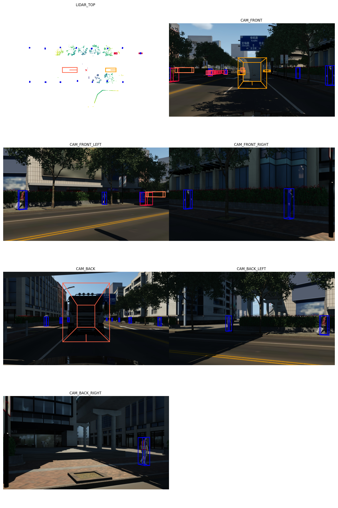
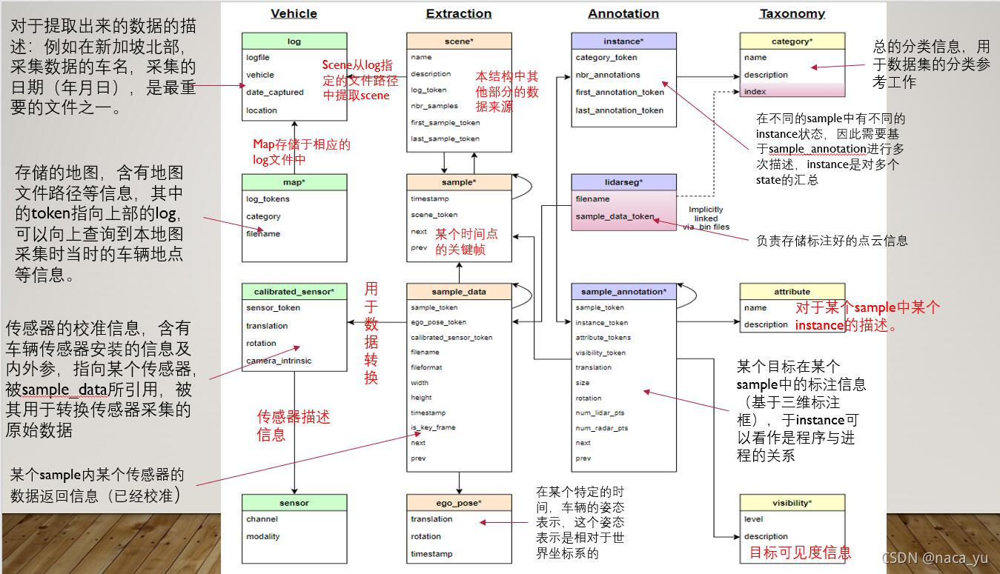
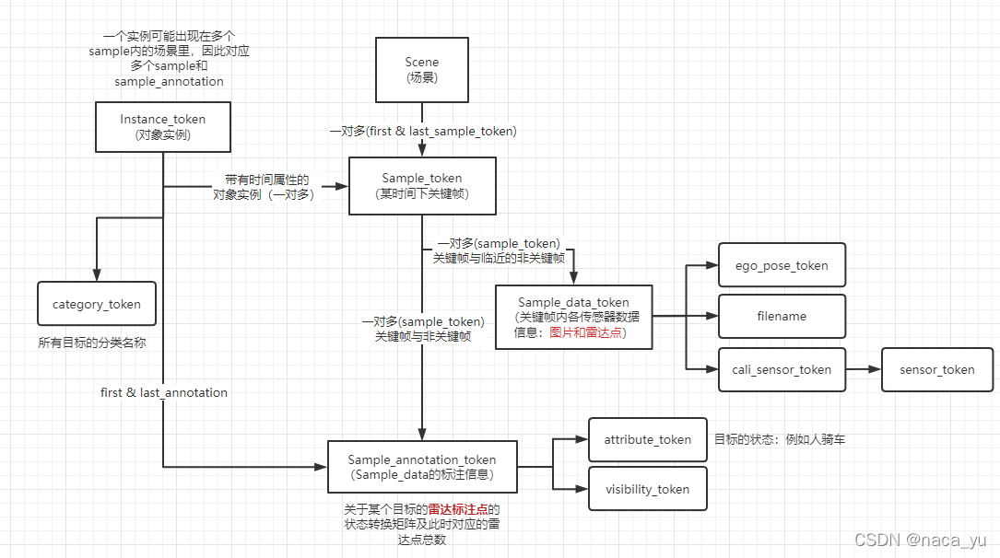

# simone2nuScenes 格式转换工具

## Introduction
nuScenes 数据集已成为当前自动驾驶感知算法领域的主流基准数据集，该脚本的目的是将 simone 直接 dump 出的原始数据转换为 nuScenes 格式，以方便地接入不同的感知算法 pipeline 中，进行3D目标检测、目标跟踪、车道线检测等感知任务。
基于该转换工具生成的样例数据集可以通过 https://huggingface.co/datasets/51WORLD/DataOne-synthetic-nuscenes-v1.1-sample 获取

## Installation
```shell
git clone https://github.com/51WORLD/simone_to_nuscenes.git
```

## simone数据生成
在`simone_nuscenes_final_version/simone_config`目录下准备了符合nuScenes数据采集标准的主车配置文件与若干用于测试的回放案例，具体内容与解释如下：
```shell
├── HuiFangAnLi # 存放了不同持续时间的回放案例
│   ├── 25s # 持续25s，大量对手车，适合BEVFusion
│   │   └── scene-C030-C040.sim
│   └── 55s # 持续55s，少量对手车，适合MapTR
│       └── scene-2002-2003.sim
└── ZhuChe # 存放了两种类型的主车配置
    ├── 2parts # 把7种传感器，分成2个部分组合dump，适用于多卡机器（四卡4090）
    │   ├── [55s]6_camera_1_lidar_front_part&lidar.json # 用于55s场景
    │   ├── [55s]6_camera_1_lidar_rear_part-.json # 用于55s场景
    │   ├── 6_camera_1_lidar_front_part&lidar.json # 用于25s场景
    │   └── 6_camera_1_lidar_rear_part.json # 用于25s场景
    └── 7parts # 把7种传感器，分别单独dump，适用于单卡机器，用于25s场景
        ├── CAM_BACK-12hz.json
        ├── CAM_BACK_LEFT-12hz.json
        ├── CAM_BACK_RIGHT-12hz.json
        ├── CAM_FRONT_12hz.json
        ├── CAM_FRONT_LEFT-12hz.json
        ├── CAM_FRONT_RIGHT-12hz.json
        └── LIDAR_TOP-20hz.json
```
请根据具体情况调整主车的dump持续时间，以创建更丰富的回放案例。

## 数据准备
### Step1. simone数据校验
- 首先需要对dump的文件进行数量和内容校验（simone的数据可能会有问题），数量一般不会有问题;

- 内容校验方法： 使用 `find . -name "CameraInfo.json" -exec grep -l -E "nan|-nan|inf|-inf" {} +` 检查是否有异常值 `例如 nan，-nan，inf，-inf` ，再用vscode等工具把异常值替换为 `0` 即可。

### Step2. dump文件存储规范
- 假设您当前的工作目录为 `/home/sim-sensor/simone_nuscenes_final_version` ，假设您当前的simone所dump的数据路径为 `/media/sim-sensor/data2/simone/dump` ，脚本需要您在工作目下创建 `simone_datasets` 目录，软连接到原始的dump路径：
```shell
ln -s [dump路径] simone_datasets
例如：ln -s /media/sim-sensor/data2/simone/dump simone_datasets
```

## 格式转换
- 格式转换由多个步骤共同完成， `run.sh` 默认运行所有步骤，使用方法为启动Terminal在当前目录下运行：

```shell
bash run.sh
```


转换后的数据存放在 `nuscenes_v1.0` ，目录结构如下：
```shell
├── maps # 地图信息暂时为空
├── samples # 关键帧图像与点云文件
│   ├── CAM_BACK
│   ├── CAM_BACK_LEFT
│   ├── CAM_BACK_RIGHT
│   ├── CAM_FRONT
│   ├── CAM_FRONT_LEFT
│   ├── CAM_FRONT_RIGHT
│   └── LIDAR_TOP
├── sweeps # 非关键帧图像与点云文件
│   ├── CAM_BACK
│   ├── CAM_BACK_LEFT
│   ├── CAM_BACK_RIGHT
│   ├── CAM_FRONT
│   ├── CAM_FRONT_LEFT
│   ├── CAM_FRONT_RIGHT
│   └── LIDAR_TOP
└── v1.0-mini # 暂时缺少部分信息
    ├── calibrated_sensor.json
    ├── ego_pose.json
    ├── instance.json
    ├── sample_annotation.json
    ├── sample_data.json
    ├── sample.json
    ├── scene.json
    └── sensor.json
```
### 补全maps与v1.0-mini部分文件
（只操作一次即可，后续转换新数据时无需重复操作）
- 将`simone_nuscenes_final_version/data/maps`目录的替换到`nuscenes_v1.0`，将`simone_nuscenes_final_version/data/v1.0-mini_general_files`中的文件添加到`nuscenes_v1.0/v1.0-mini`

---

请注意，如果在脚本转换某一步骤发生报错，可以手动注释 run.sh 中对应的步骤如 step1、step2 （耗时较长且无需重复输出相同图像与点云文件的需要时），从而快速定位问题并继续后续流程。

## 转换步骤详解

1. 预处理文件 lidar.pcd转换成lidar.pcd.bin 输出至目标文件夹和创建文件结构
```python
python preprocess.py
```
2. 首先通过RAW2JPG.py 把CAM dump下的COLOR 转换成JPG文件，同时连同Lidar 的文件夹一并copy到nuscenes_v1.0/samples
```python
python RAW2JPG.py
```
3. 通过create_token.py 预生成包含scene,sensor和对应scene下的samples以及ego_pose的data/token.json和data/ego_pose.json(需要注意的是，预生成文件都会保存在data文件夹，一定不是保存在nuscenes_v1.0/v1.0-mini，需要通过后处理才能生成对应json，下文出现时需自行判断)
```python
python create_token.py
```
4. 通过data/token.json和ego_pose.json 生成nuscenes_v1.0/samples的scene.json,sensor.json,sample.json,ego_pose.json(无所谓前后顺序)
```python
python generate_scene.py
```
```python
python generate_sample.py
```
```python
python generate_sensor.py
```
```python
python generate_ego_pose.py
```
5. 生成calibrated.json,通过calibrated来生成sample_data.json
```python
python create_calibrated_sensor_token.py
```
```python
python generate_calibrated_sensor.py
```
```python
python generate_sample_data.py
```
6. 生成sample_annotation最后生成instance.py
```python
python generate_sample_annotation.py
```
```python
python generate_instances.py
```

## 标注文件可视化
该脚本支持通过 nuScenes 官方工具包 nuscenes-devkit 验证数据标签的一致性，确保由 1 个 LiDAR 和 6 个相机生成的 BEV（鸟瞰图）与标注数据精确对齐，从而保证数据的准确性和可用性。
````python
python devkit_test.py
````


## 数据集关键属性说明


